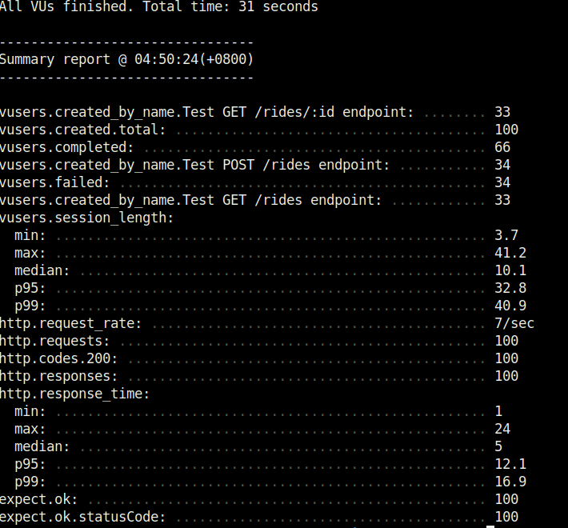

<h1 id="api-spec">API Spec v1.0.0</h1>

This document provides specifications for how the API works.
We only provide one API - HTTP REST.
For detailed information about each API visit the REST API section.

## Artillery Test Result


# REST API

The REST API allows developers to `CREATE`, `READ` rides.

# Swagger UI

Swagger UI is accessible on http://localhost:8010/api-docs

<b>NOTE: Please run the server before going to the Swagger UI.</b>
## Create Ride

`POST /rides`

> Sample Request http://localhost:8010/rides
```json
{
  "start_lat": 10,
  "start_long": 100,
  "end_lat": 20,
  "end_long": 50,
  "rider_name": "Dylan1",
  "driver_name": "Dylan1",
  "driver_vehicle": "Vehicle1"
}
```

> 200 Response
```json
[
  {
    "rideID": 3,
    "startLat": 10,
    "startLong": 100,
    "endLat": 20,
    "endLong": 50,
    "riderName": "Dylan3",
    "driverName": "Dylan3",
    "driverVehicle": "Vehicle3",
    "created": "2021-09-14 21:06:51"
  }
]
```

> Error Response
```json
{
  "error_code": "VALIDATION_ERROR",
  "message": "<error message here>"
}
```

An endpoint that allows developers to submit a ride details and create it.

**Request Schema**

| Name           | Type   | Required | Description                 |
| -------------- | ------ | -------- | --------------------------- |
| start_lat      | number | true     | Start latitude of the ride  |
| start_long     | number | true     | Start longitude of the ride |
| end_lat        | number | true     | End latitude of the ride    |
| end_long       | number | true     | End longitude of the ride   |
| rider_name     | string | true     | Rider alias                 |
| driver_name    | string | true     | Full name of driver         |
| driver_vehicle | string | true     | Driver vehicle              |

**Response Schema**

| Name          | Type   | Description                   |
| ------------- | ------ | ----------------------------- |
| rideId        | number | Unique identifier of the ride |
| startLat      | number | Start latitude of the ride    |
| startLong     | number | Start longitude of the ride   |
| endLat        | number | End latitude of the ride      |
| endLong       | number | End longitude of the ride     |
| riderName     | string | Rider alias                   |
| driverName    | string | Full name of driver           |
| driverVehicle | string | Driver vehicle                |
| created       | string | The response timestamp        |

## Get all rides

`GET /rides`

> Sample Request http://localhost:8010/rides
> 200 Response
```json
[
    {
        "rideID": 1,
        "startLat": 10,
        "startLong": 100,
        "endLat": 20,
        "endLong": 50,
        "riderName": "Dylan",
        "driverName": "Dylan",
        "driverVehicle": "Vehicle",
        "created": "2021-09-14 21:03:14"
    },
    {
        "rideID": 2,
        "startLat": 10,
        "startLong": 100,
        "endLat": 20,
        "endLong": 50,
        "riderName": "Dylan1",
        "driverName": "Dylan1",
        "driverVehicle": "Vehicle1",
        "created": "2021-09-14 21:04:57"
    },
    ...
]
```

Send a request to retrieve all rides.

**Response Schema**

| Name          | Type   | Description                   |
| ------------- | ------ | ----------------------------- |
| rideId        | number | Unique identifier of the ride |
| startLat      | number | Start latitude of the ride    |
| startLong     | number | Start longitude of the ride   |
| endLat        | number | End latitude of the ride      |
| endLong       | number | End longitude of the ride     |
| riderName     | string | Rider alias                   |
| driverName    | string | Full name of driver           |
| driverVehicle | string | Driver vehicle                |
| created       | string | The response timestamp        |


## Get specific ride

`GET /rides/:id`

> Sample Request http://localhost:8010/rides/1
> 200 Response
```json
[
    {
        "rideID": 1,
        "startLat": 10,
        "startLong": 100,
        "endLat": 20,
        "endLong": 50,
        "riderName": "Dylan",
        "driverName": "Dylan",
        "driverVehicle": "Vehicle",
        "created": "2021-09-14 21:03:14"
    }
]
```

> Error Response
```json
{
    "error_code": "RIDES_NOT_FOUND_ERROR",
    "message": "Could not find any rides"
}
```

Send a request to retrieve a specific ride.

**Response Schema**

| Name          | Type   | Description                   |
| ------------- | ------ | ----------------------------- |
| rideId        | number | Unique identifier of the ride |
| startLat      | number | Start latitude of the ride    |
| startLong     | number | Start longitude of the ride   |
| endLat        | number | End latitude of the ride      |
| endLong       | number | End longitude of the ride     |
| riderName     | string | Rider alias                   |
| driverName    | string | Full name of driver           |
| driverVehicle | string | Driver vehicle                |
| created       | string | The response timestamp        |


